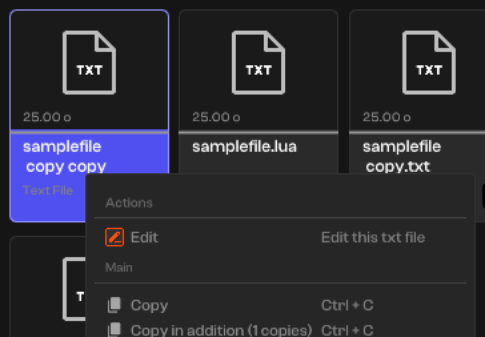
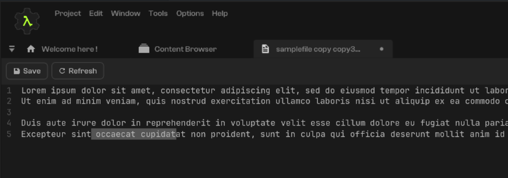

---

*A very simple and tiny text editor. Open, edit and save config files, text files easely.*

### Features :
- Open and edit text files with a simple editor

---

### Previews and Examples :

<a href="https://cherry.infinite.si">
    <picture>
      <source media="(prefers-color-scheme: dark)" srcset="./main/assets/resources/readme/1.png">
      
    </picture>
</a>

<a href="https://cherry.infinite.si">
    <picture width="50">
      <source media="(prefers-color-scheme: dark)" srcset="./main/assets/resources/readme/2.png">
      
    </picture>
</a>